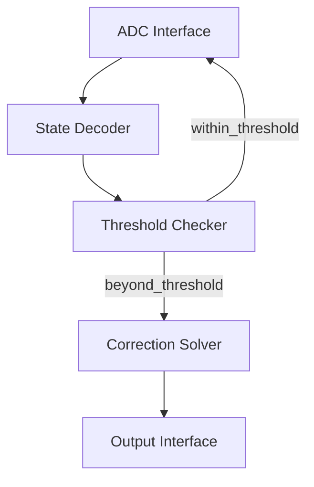

# Qwn Polarization Compensator
Real-time Stokes-parameter computation and QWP/HWP/LCR correction math for QWN polarization compensation on FPGA.

## Background

This project extends the polarization tracking and active compensation scheme
described in:

> Gül et al., "Polarization Tracking and Active Compensation Using Classical
> Headers in Quantum Wrapper Networking," arXiv:2604.09846v2 [quant-ph], 2026.

In that work, classical reference headers (two non-orthogonal polarization
states, V and D) co-propagate with a quantum payload through deployed fiber.
A polarimeter measures how the headers' polarization was rotated by the
fiber's birefringence, and a compensator (QWP + HWP + LCR) applies the inverse
rotation to correct the channel.

Currently, the measurement chain is: polarimeter → MCC DAQ 1208HS (ADC) → PC
software (Python) computes the correction → USB commands to motorized stages
and LCR driver. This project replaces the ADC + PC-software steps with
an FPGA doing the Stokes calculation and correction math directly, which
becomes valuable if paired with faster compensator hardware (the mechanical
stages are the current bottleneck).

## Architecture

The hardware performs **two passes** per compensation cycle: the first pass
digitizes the V-polarization header, the State Decoder computes its Stokes
parameters and angles, and the Correction Solver latches the result into an
internal register. The second pass then repeats the same pipeline for the
D-polarization header. Only after both results are available does the Threshold
Checker decide whether a correction is needed.

ADC Interface and Output Interface are hardware-dependent stubs — they will be
filled in once an ADC and compensator-driver interface are chosen. The State
Decoder, Threshold Checker, and Correction Solver form the math core and can
be built and simulated with synthetic test vectors now, with no hardware
dependency.

## Modules

| Module | Responsibility |
|---|---|
| `qwn_polarization_compensator` | Top module — instantiates and connects all submodules below |
| `adc_interface_stub` | Placeholder for the real ADC interface; currently just a data source for simulation |
| `state_decoder` | Combines `stokes_calc` and `angle_calc`: converts raw ADC samples into normalized Stokes values (S1, S2, S3) and then computes ψ (orientation), χ (ellipticity), δ (residual phase angle) via Eq. 3 |
| `threshold_checker` | Compares the decoded V and D reference states against tolerance thresholds; asserts `beyond_threshold` to trigger a correction cycle or `within_threshold` to loop back for the next measurement |
| `correction_solver` | Latches the V-pass result (ψ, χ, δ) into an internal register on the first pass; combines it with the D-pass result on the second pass to compute the required QWP angle, HWP angle, and LCR retardance following the paper's 3-step algorithm (Sec. 3A) |
| `output_interface_stub` | Placeholder for driving the physical waveplate stages and LCR voltage |
