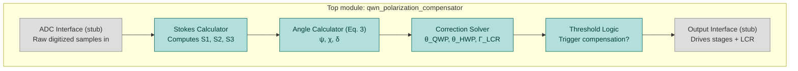

# qwn_polarization_compensator
Real-time Stokes-parameter computation and QWP/HWP/LCR correction math for QWN polarization compensation on FPGA.

## Background

This project extends the polarization tracking and active compensation scheme
described in:

> Gül et al., "Polarization Tracking and Active Compensation Using Classical
> Headers in Quantum Wrapper Networking," arXiv:2604.09846v2 [quant-ph], 2026.

In that work, classical reference headers (two non-orthogonal polarization
states, V and D) co-propagate with a quantum payload through deployed fiber.
A polarimeter measures how the headers' polarization was rotated by the
fiber's birefringence, and a compensator (QWP + HWP + LCR) applies the inverse
rotation to correct the channel.

Currently, the measurement chain is: polarimeter → MCC DAQ 1208HS (ADC) → PC
software (Python) computes the correction → USB commands to motorized stages
and LCR driver. This project replaces the ADC + PC-software steps with
an FPGA doing the Stokes calculation and correction math directly, which
becomes valuable if paired with faster compensator hardware (the mechanical
stages are the current bottleneck).

## Architecture

Gray modules (ADC Interface, Output Interface) are hardware-dependent stubs —
they'll be filled in once an ADC and compensator-driver interface are chosen.
Teal modules are the math core and can be built and simulated with synthetic
test vectors now, with no hardware dependency.

## Modules

| Module | Responsibility |
|---|---|
| `qwn_polarization_compensator` | Top module — instantiates and connects all submodules below |
| `adc_interface_stub` | Placeholder for the real ADC interface; currently just a data source for simulation |
| `stokes_calc` | Converts a raw digitized ADC sample into a normalized Stokes value (S1, S2, or S3) |
| `angle_calc` | Implements Eq. 3: computes ψ (orientation), χ (ellipticity), δ (residual phase angle) from Stokes values |
| `correction_solver` | Computes the required QWP angle, HWP angle, and LCR retardance from ψ, χ, δ, following the paper's 3-step algorithm (Sec. 3A) |
| `threshold_logic` | Compares measured V/D reference states against tolerance thresholds and decides whether to trigger a compensation cycle |
| `output_interface_stub` | Placeholder for driving the physical waveplate stages and LCR voltage |